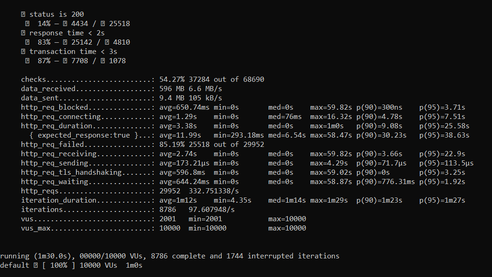

# Отчет о проведении тестирования производительности
### Отчет тестировщика о состоянии проекта
ФИО: Суходолов Матвей Сергеевич
Дата: 15 октября 2024
Название проекта: Сайт [Литовского сейма](https://www.lrs.lt/)
ID заявки на тестирование: 1
Номер версии релизной сборки: 1.0.0

### Цель тестирования
Цель тестирования заключается в подтверждении заявленной
производительности сайта сейма Литвы, а также в
определении его максимальной производительности. Требования к
производительности включают возможность обработки до 10000
пользователей одновременно, время отклика страницы не более 2 секунд,
и обработка транзакций с временем выполнения не более 3 секунд.

### Конфигурация стенда
Серверы: 1 сервер
Ядра процессора: 6 ядер на сервер
Память: 32 GB RAM на сервер 
Операционная система: Windows 10 Pro
Вспомогательное ПО: Node.js, Docker, K6, Grafana, Prometheus, Cadvisor, InfluxDB

### Сценарий тестирования
Тестирование было выполнено с использованием K6 для симуляции
нагрузки. В сценарии тестирования предусматривались следующие шаги:
- Переход на страницу сайта https://www.lrs.lt/, далее переход на страницу https://www.lrs.lt/sip/portal.show?p_r=35401&p_k=1, далее переход на страницу https://www.lrs.lt/sip/portal.show?p_r=35525&p_k=1. 
- Колличество пользователей 10000 - продолэительность теста 60 секунд.
Во время тестирования особое внимание уделялось времени отклика
страниц, стабильности системы при высокой нагрузке, и корректности
выполнения транзакций.

### Отчет

Сводка:
Всего проверок:68690* Успешных проверок:37284 (54.27%)  
Получено данных:596 МБ (6.6 МБ/с)  
Отправлено данных:9.4 МБ (105 кБ/с)    

Производительность запросов HTTP:  
Среднее время блокировки:650.74 мс* Среднее время соединения:1.29 с* Средняя длительность запроса:3.38 с* Среднее время ответа:11.99 с (только для ожидаемых ответов)
Неудачные запросы:85.19% (25518 из29952)
  
Производительность передачи данных:  
Среднее время получения:2.74 с* Среднее время отправки:173.21 мкс* Среднее время шифрования HTTPS:596.8 мс* Среднее время ожидания после шифрования HTTPS:0 с* Среднее время ожидания перед отправкой HTTP:644.24 мсМетрики теста:
Всего запросов HTTP:29952 (332.751338/с)

Средняя продолжительность итерации:1 минута12 секунд* Всего итераций:8786 (97.607948/с)

Максимальное количество одновременных пользователей (VUs):10000 

Продолжительность теста:1 минута30 секундРезультат теста:8786 завершенных итераций,1744 прерванных итераций, с выполненных из10000 виртуальных пользователей.

Предполога

.png)
На данном графике запущенные докер-контейнеры, контейнер K6 запустился названием "fervent_herschel".  
Также на данных графиках мы видим:
- нагрузку на сервер (CPU) до 17,3%.
- использование памяти(Memory usage) до 2,54 GIB.
- кэширование памяти(Memory cached) до 31,8 Мб.
- полученный сетевой трафик (Received network traffic) до 2 Мб/с.
- Отправленный сетевой трафик (Sent network traffic ) до 131 кб/с

### Найденные в процессе дефекты
В процессе выполнения теста дефекты не были обнаружены.

### Трудоемкость
3 календарных дня

### Выводы:
1. Сайт сейма Литвы выдержал нагрузку на свой сайт и справился с угрозой атаки.
2. В связи с тем, что адрес с которого я проводил тестирования заблокирован - нельзя с уверенностью предпологать, выдержит ли сайт реальную нагрузку(в дни, когда колличество потенциальных пользователей будет расти)

# Производительность не подтверждена
